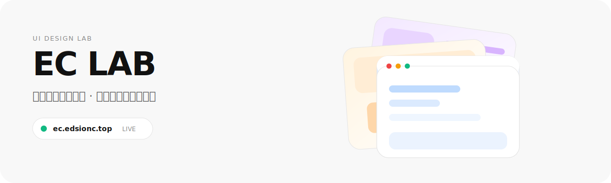
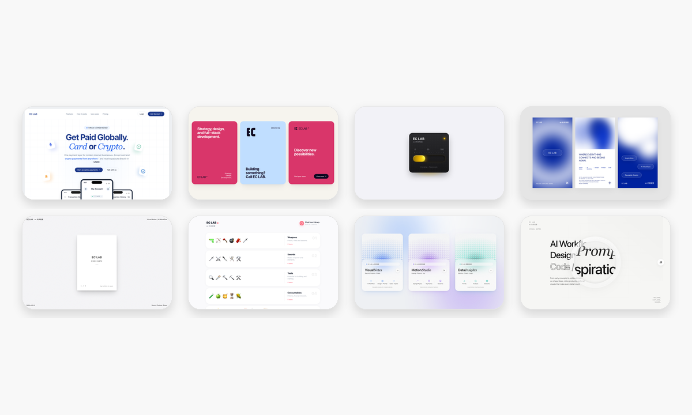

> 中文版: [README.md](README.md)

---

<p align="center">
  
</p>

<p align="center">
  <a href="https://ec.edsionc.top" target="_blank"><strong>ec.edsionc.top</strong></a> · Single-file HTML/CSS/JS experiments · Open and remix
</p>

---

## What this is

**EC LAB** is my personal UI design laboratory. Glassmorphism, liquid motion, pixel art, flip cards, face portals — whenever a design idea makes me think *"this is cool"*, I build a static demo and drop it here.

Every project is a **single HTML file**: no frameworks, no CDN, no build step. Open it, read the code, copy what you like.

<p align="center">
  
</p>

## How to use

Each project folder has just three files:

```
project-name/
├── preview.html   ← Complete HTML/CSS/JS with styles and interactions
├── meta.json      ← Prompt and design-token metadata
└── README.md      ← Design notes
```

**Use it directly:**

1. Open `preview.html`
2. Pick the snippet you like
3. Copy and paste it into your own project
4. Change the CSS variables (`var(--xxx)`) to recolor

**Use it as an AI reference:**

- The `prompt` / `html_prompt` field in `meta.json` can be fed directly to GPT / Claude / Cursor to generate new pages in the same style
- The `css` tokens (colors, fonts, radii, shadows) are ready to reuse

## Projects

| # | Project | Style Keywords |
|---|---------|----------------|
| 01 | EC Global Payments Hero | Dark glassmorphism, 3D sphere, gold particles |
| 02 | Ostraka UI Cards | Paper texture, monospace, retro terminal |
| 03 | EC LAB Charging Progress | Liquid progress, glassmorphism, Bézier curves |
| 04 | EC Blue Glass Triptych | Blue glass, triptych parallax, diffused glow |
| 05 | EC Flip Word Notes | Flip cards, split notes, elastic transitions |
| 06 | Pixel Icon Library | Pixel icons, instant search, masonry grid |
| 07 | Fluid Interactive Cards | Fluid gradient, morphing blobs, dynamic glow |
| 08 | Visual Notes Magnifier | Magnifier gradient, floating panels, light mapping |
| 09 | Craft Family Design System | Glassmorphism, ambient light, Dock navigation |
| 10 | Code-G Artifact | Scroll transition, face portal, 3D parallax |
| 11 | Interactive Corkboard | Corkboard, draggable notes, pin-and-string |

## Local preview

```bash
# Option 1: Python (recommended)
python3 -m http.server 4173

# Option 2: Open index.html directly
# Some projects may not load meta.json fully over file://
```

Then visit `http://localhost:4173/index.html`.

## Tech notes

- **Zero dependencies**: no CDN, no frameworks, no build tools — just vanilla browser APIs
- **Pure static**: deploy anywhere — GitHub Pages, Cloudflare Pages, Netlify, Vercel, or any static host
- **Hackable**: CSS variables are centralized in `:root` — change one value, update the whole theme
- **Responsive**: every project works on desktop and mobile

---

<p align="center">
  ⭐ Star the repo · 🔁 Fork and remix
</p>

